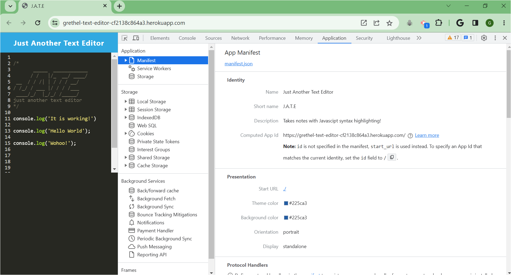
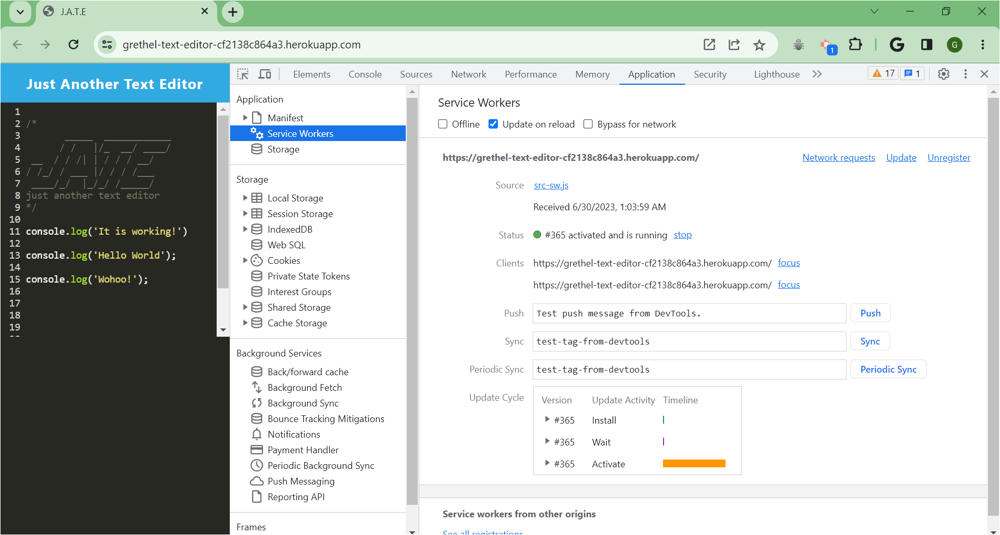
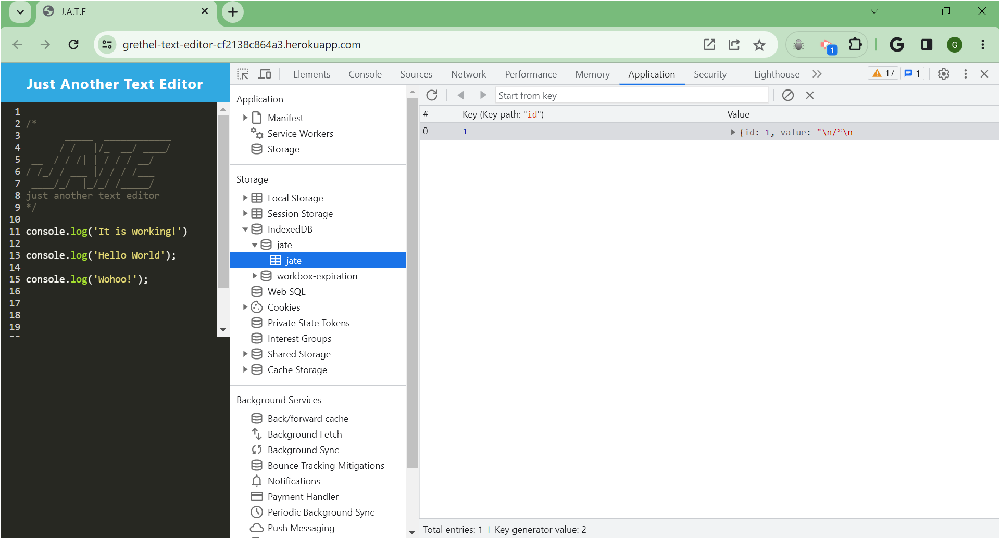

# Text Editor

## Description

This text editor application runs in the browser and also function offline. The app is a single page application that meets PWA. It feature data persistence technique that serve as redundancy in case one of the options is not supported by the browser. This application implement methods for getting and storing data to an IndexedDB database. It also use the `idb` package, which is a lightweight wrapper around the IndexedDB API. It features a number of methods that are useful for storing and retrieving data, and is used by companies like Google and Mozilla.

Link to the deployed app on Heroku: [https://grethel-text-editor-cf2138c864a3.herokuapp.com/]

## Table of Contents

* [Installation](#Installation)  
* [Usage](#Usage)   
* [Walkthrough Video](#Walkthrough-Video) 
* [License](#License)    
* [Questions](#Questions)

## Installation 

1. Clone the repository at [https://github.com/Garethus/text-editor] of this project from Github into your local machine. 
2. Navigate to the project's directory. 
3. Run `npm install` to install the npm package dependencies. 
4. Then, run `npm run start:dev` and `npm run start` in terminal to start.
5. Open http://localhost:3000/ in your browder to run this application on your local machine.

## Usage

Use Heroku deployed link: [https://grethel-text-editor-cf2138c864a3.herokuapp.com/] and install if you want to use it offline.

## Walkthrough-Video

The following animation demonstrates the application functionality:

The following image shows the application's `manifest.json` file:

The following image shows the application's registered service worker:

The following image shows the application's IndexedDB storage:

## License

Licensed under the [MIT](./LICENSE) license.

## Contributing

If you want to help me make this application better, clone the repo, commit your changes and create a pull request. Thanks!

## Questions
    
If you have any questions about the project please contact me through my [GitHub](https://github.com/Garethus) or email me at reyes.grethelmaec@gmail.com.

